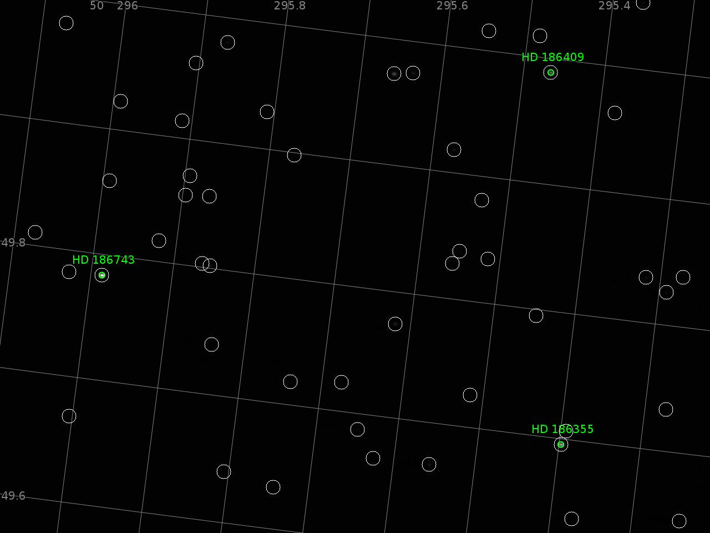

# My astro playground

v4l2_camera.py - hack to allow raw mode and better exposure control for
cheap webcamera ELP-USB130W01MT

navigate.py - run astrometry.net on camera image in real time:

This program is free software; you can redistribute it and/or modify
it under the terms of the GNU General Public License as published by
the Free Software Foundation; either version 2 of the License, or
(at your option) any later version.

